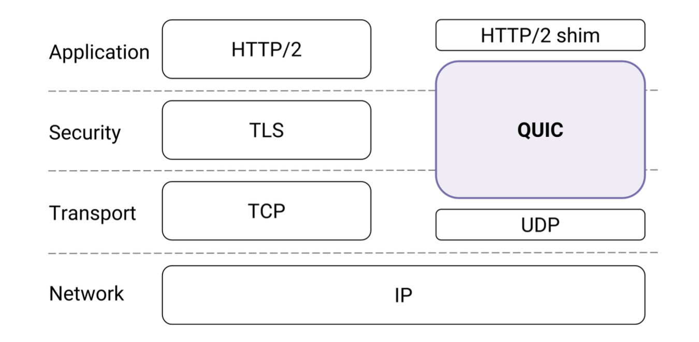
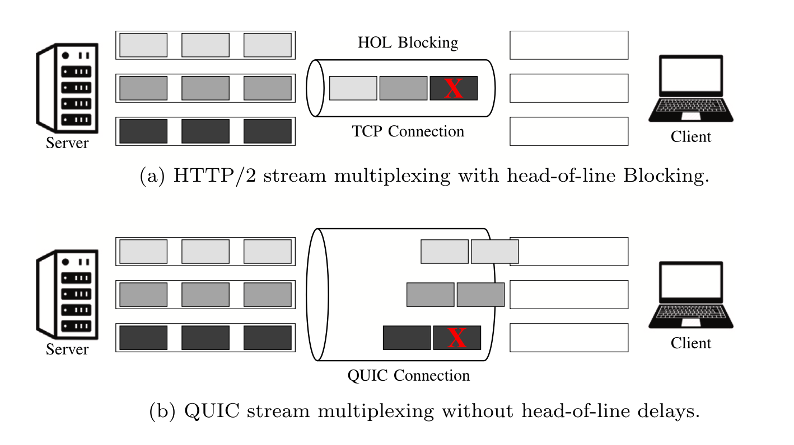

- [QUIC: A UDP-Based Multiplexed and Secure Transport](https://datatracker.ietf.org/doc/rfc9000/)
- [The QUIC Transport Protocol: Design and Internet-Scale Deployment](https://doi.org/10.1177/14614448251336438)
- [pFabric: minimal near-optimal datacenter transport](https://doi.org/10.1145/2486001.2486031)
- [Flexible Priority-based Stream Schedulers in QUIC](https://doi.org/10.1145/3616394.3618267)

QUIC is a transport-layer protocol that underlies the latest version of the Hypertext Transfer Protocol, HTTP/3. As a transport layer protocol, it describes a new way of how two endhosts can establish a connection and communicate over the Internet. Its main goal is to reduce communication latency.

Launched in 2016 and standardized by IETF in 2021, QUIC is now used by major internet players like Meta, Google, Cloudflare, Alibaba, and Microsoft. As of early 2024, it's estimated to carry nearly half of all internet traffic across Europe, Latin America, and the United States. \[1\] \[2\]

## The QUIC Transport Protocol: Design and Internet-Scale Deployment

QUIC replaces the traditional HTTPS stack (IP → TCP → TLS → HTTP/2) with a remodeled stack built on IP → UDP → QUIC → HTTP/3. Their main claim is that TCP has ossified. That is, updating or enhancing the TCP protocol would require massive, Internet-wide device and software changes, making such evolution impractical. Therefore, they use another transport-layer protocol already well supported by Internet devices, UDP, as the foundation for their new protocol.

QUIC has three major features: 
1. It prevents TCP's Head-of-line blocking problem by introducing the *stream* abstraction, where each established connection can have multiple independent streams (typically corresponding to different application tasks or resources)
    - In contrast, TCP provides a single, ordered byte stream without internal separation between tasks (all packets for different tasks are interweaved in one single big "stream"). Therefore, the loss of a single TCP packet delays the delivery of all subsequent packets (regardless of which task they belong to) until the missing packet is retransmitted.
    - <figure>
        
        <figcaption>[3]</figcaption>
    </figure>
2. It uses a cryptographic handshake that replaces the three-way handshake in TCP. 
3. Its packets are end-to-end encrypted and authenticated, which prevents it from being modified by middleboxes (e.g., NATs, firewalls)

We chose QUIC because: 
1. We want to exploit the stream abstraction in QUIC, annotate flows by their expected length, and build a scheduling policy that favors shorter streams over longer streams. 
2. QUIC is newer, more timely and does not yet include the scheduling mechanism we aim to design. 

## QUIC: A UDP-Based Multiplexed and Secure Transport (RFC9000)

> RFC (Request for Commments): is a series of publication that documents and standardizes protocols of the Internet. 
> 
> Below are quotes from the RFC

Streams are identified within a connection by a numeric value, referred to as the stream ID. A stream ID is a 62-bit integer that is unique for all streams on a connection (from Section 2.1. Stream Types and Identifiers). 

**Importantly** Stream multiplexing can have a significant effect on application performance if resources allocated to streams are correctly prioritized. QUIC itself does not provide a mechanism for exchanging prioritization information. Instead, it relies on receiving priority information from the application. **A QUIC implementation SHOULD provide ways in which an application can indicate the relative priority of streams** (from Section 2.3: Stream Prioritization). 

- Example: In an HTTP/3 session using QUIC, a browser might open one QUIC connection to a web server and create separate *streams* for different resources belonging to the same page. For example, one stream for the HTML file, others for CSS stylesheets, JavaScript files, and images. Each stream is transmitted independently, even in the same established connection. Therefore, if a packet from the image stream is lost, it does not block the delivery of the HTML or CSS streams. 

In short, we want to add a mechanism in the INET-QUIC implementation of QUIC that allows applications indicate the relative priority of streams. 

## pFabric: minimal near-optimal datacenter transport

Extensive research has been done in TCP scheduling that takes in consideration of shorter v.s. longer flows. 

The premise is that short flows are more latency sensitive than longer flows. For example, a short flow would be an HTTP page request or a small API call fetching user profile data; a long flow would be a database backup or a video upload. Typically, shorter flows are for tasks that are more interactive with users. Therefore, users would immediately notice the delay (10-20 microseconds get expanded to tens of milliseconds).

The paper points out that short flows in data centers are extremely latency-sensitive, yet in traditional TCP-based data center, they suffer from high completion times (FCT) because they get queued behind long flows. Recent research (as of 2013) has only tackled this problem through rate control. In contrast, pFabric considers *both* rate control and scheduling. Specifically:
- Priority: end-hosts put a single number in the header of every packet that encodes its priority (e.g., the flow's remaining size, deadline). This priority is set to each flow.
    - When a new packet arrives and the buffer is full, if the incoming packet has lower priority than all buffered packets, it is dropped; else, the lowest priority packet in the buffer is dropped and replaced with the incoming packet.
- Rate control: Initially sent at line-rate (maximum rate that the network interface can handle), and would reduce rate if persisting packet loss happens. 

We take inspiration from assigning priorities to packets and want to bring this idea to TCP's newer counterpart: QUIC.

## Flexible Priority-based Stream Schedulers in QUIC

> Below are direct quotes from paper abstract (no ACM access given to the actual article)

Exploiting the proposed approach, applications are able to set the required scheduling scheme, as well as the stream priorities. The feasibility of the proposed approach is validated through an extensive experiment campaign, which combines Docker containers and the ns-3 simulator to emulate different connectivity characteristics. The results evince that an appropriate stream scheduler can indeed yield lower delays for strict time-sensitive applications by up to 36% under unreliable conditions.

We are happy to know our approach is feasible since someone has already done something similar with QUIC. This project focuses on a wireless communication setting in 5G systems and non-terrestrial networks. In contrast, our project focuses on a datacenter setting with wired commodity-node, where network conditions are generally more stable.

## Reference

\[1\] Perarnaud, C., & Musiani, F. (2025). QUIC, or the battle that never was: A case of infrastructuring control over Internet traffic. New Media & Society, 0(0). https://doi.org/10.1177/14614448251336438

\[2\] Cisco (2024) The Internet and CDNs. Some Observations from a Network Perspective. Available at: https://2024.apricot.net/assets/files/APIC378/the-internet-and-cdn_1709097576.pdf 

\[3\] Fátima Fernández, Mihail Zverev, Luis Diez, José R. Juárez, Anna Brunstrom, and Ramón Agüero. 2023. Flexible Priority-based Stream Schedulers in QUIC. In Proceedings of the Int'l ACM Symposium on Performance Evaluation of Wireless Ad Hoc, Sensor, & Ubiquitous Networks (PE-WASUN '23). Association for Computing Machinery, New York, NY, USA, 91–98. https://doi.org/10.1145/3616394.3618267

\[4\]: RFC 9000 — “QUIC: A UDP-Based Multiplexed and Secure Transport” (IETF, 2021) and RFC 9114 — “HTTP/3” 